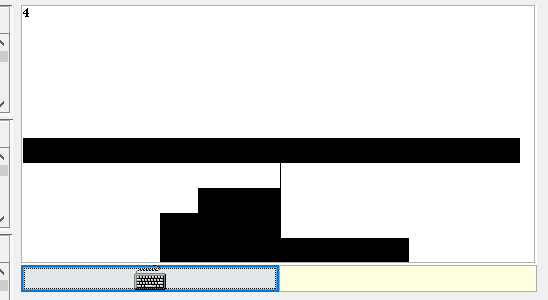
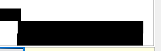
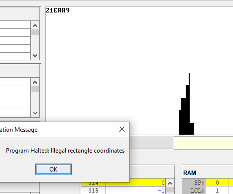

# Понравилось
 - идея игры
 - механика сдвига башни
 - user friendly interface and controlling
 - отформатированный код

 В целом в игру интересно играть убил 3 часа на ревью этого проекта=\)

---
# Не понравилось
- нету быстрого рестрарта
- отсутствие разбиения кода на классы (сложно читать монолитный код)
## Баги (вам лучше не знать сколько по времени я их искал)
- баг одного пикселя

- баг неправильного размера обрезания прямоугольника

- баг который я пытался воспроизвести два часа

- изменение размера курсора

---
# Предложения
Добавить возможность повторной игры и настройки скорости