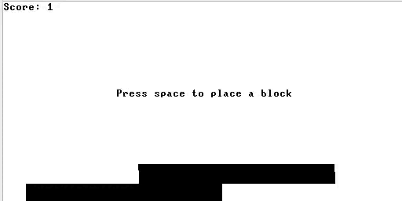
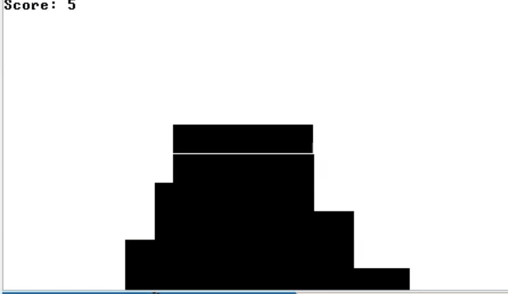

# Плюсы
 - очень интересная и затягивающая игра
 - хорошо структурированный и читаемый код(интуитивно понятные названия переменных и методов, разбиение на классы и методы)
 - возможность быстрого рестарта
 - за время игры серьезных багов мне выявить не удалось

 # Минусы
  - в метод reduceLastBlockWidth было бы неплохо либо добавить коментарии, либо разбить его на вспомогательные методы, так как он явно перегружен условиями
  - блоки не всегда двигаются с одинаковой скоростью

  

  - иногда при добавлении нового блока появляются пробелы

  
