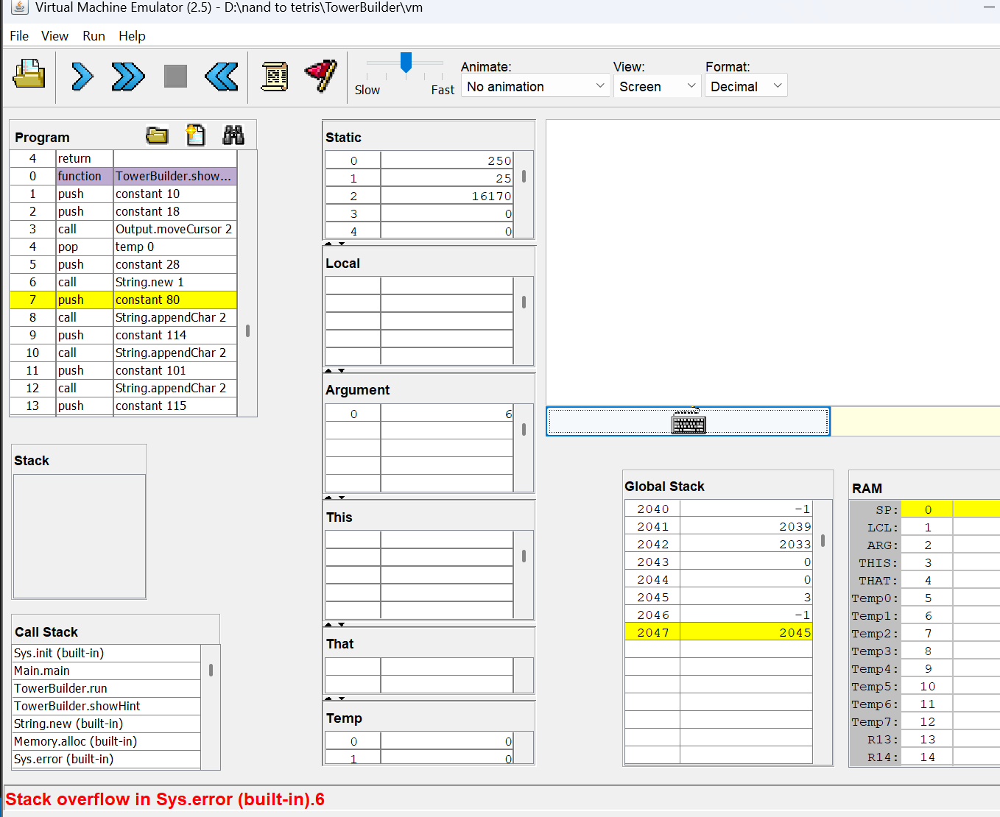
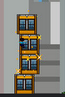

# Интерфейс
## +вайбы
1. несложный, супер юзерфрендли интерфейс, удобно играть
## -вайбы
1. отловила ошибку переполнения стека, если играть много раз через перезапуски 



2. если играть долго и с перезапусками вылетает еще и heap overflow (само окошечко с надписью было упущено :(( )


## неожиданности 
необычно, что когда блок приземляется, то он обрезается в тех местах, где выходит за границу башенки 



$\uparrow$ ожидалось что-то такое, но это особенность, это даже клево, просто необычно

# Код
## +вайбы
1. хорошая струтура
2. все логично, просто и понятно
## -вайбы (скорее просто мелкие доработки)
1. тут скорее предложение, но можно было бы вынести метод ```reduceLastBlockWidth``` в класс блока, вызывать от последнего блока, как будто было бы чуть логичнее
2. если быть уж совсем дотошными, то можно сделать класс ```score```, вынести туда инкрементер, вывод на экран и его dispose